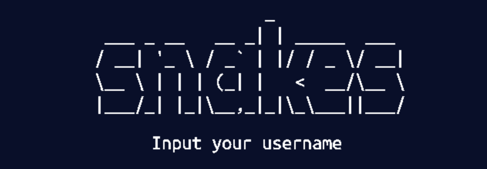

# Udacity Capstone Snake Game

<p align='center'>
  
</p>

c++ Snake Game made with SDL2, this project compiles all modules learned throghout the `c++ nanodegree`, OOP, Memory management and Concurrency.

<p align='center'>
  
</p>


# Features
- A Sneak game
- Navigation through 4 Screens ( Onboarding, Menu, Leaderboard, Game )
- Accepts user input to write a username
- Leaderboard stored locally with the 10 best scores
- Replayability

## SDL2_ttf
When rendering texts on the screen, i had some problem with the SDL2_ttf, the CMakeLists couldnt find the file location, had to use a third party `FindSDL2_ttf.cmake` that i found.

## Rubric
- Loops, Funcitons, I/O
  - Reading data from file and writing data on file (leaderboard_manager.cpp)
  - Code organized into functions / classes
  - The project accepts user input and procces the input (controller.cpp)

- OOP
  - One or more classes added to the project
  - Class constructors with initialization lists
  - Classes abstracts implementation details from their interfaces

- Memory management
  - Use of references (controller.cpp)
  - Use of destructors (renderer.cpp)
  - Use of move semantics (game_manager.cpp)
  - Use of smart pointers (controller.h)

- Concurrency
  - The project uses multithreading (game_manager.cpp)
  - Promise and future (game_manager.cpp/leaderboard_manager.cpp)

## Dependencies for Running Locally
* cmake >= 3.7
  * All OSes: [click here for installation instructions](https://cmake.org/install/)
* make >= 4.1 (Linux, Mac), 3.81 (Windows)
  * Linux: make is installed by default on most Linux distros
  * Mac: [install Xcode command line tools to get make](https://developer.apple.com/xcode/features/)
  * Windows: [Click here for installation instructions](http://gnuwin32.sourceforge.net/packages/make.htm)
* SDL2 >= 2.0
  * All installation instructions can be found [here](https://wiki.libsdl.org/SDL2/Installation)
  >On Mac you can run
  ```
  brew install SDL2
  brew install SDL2_image
  brew install SDL2_ttf
  ```

  >Note that for Linux, an `apt` or `apt-get` installation is preferred to building from source. 
* gcc/g++ >= 5.4
  * Linux: gcc / g++ is installed by default on most Linux distros
  * Mac: same deal as make - [install Xcode command line tools](https://developer.apple.com/xcode/features/)
  * Windows: recommend using [MinGW](http://www.mingw.org/)

## Basic Build Instructions

1. Clone this repo.
2. Make a build directory in the top level directory: `mkdir build && cd build`
3. Compile: `cmake .. && make`
4. Run it: `./SnakeGame`.


## CC Attribution-ShareAlike 4.0 International


Shield: [![CC BY-SA 4.0][cc-by-sa-shield]][cc-by-sa]

This work is licensed under a
[Creative Commons Attribution-ShareAlike 4.0 International License][cc-by-sa].

[![CC BY-SA 4.0][cc-by-sa-image]][cc-by-sa]

[cc-by-sa]: http://creativecommons.org/licenses/by-sa/4.0/
[cc-by-sa-image]: https://licensebuttons.net/l/by-sa/4.0/88x31.png
[cc-by-sa-shield]: https://img.shields.io/badge/License-CC%20BY--SA%204.0-lightgrey.svg
